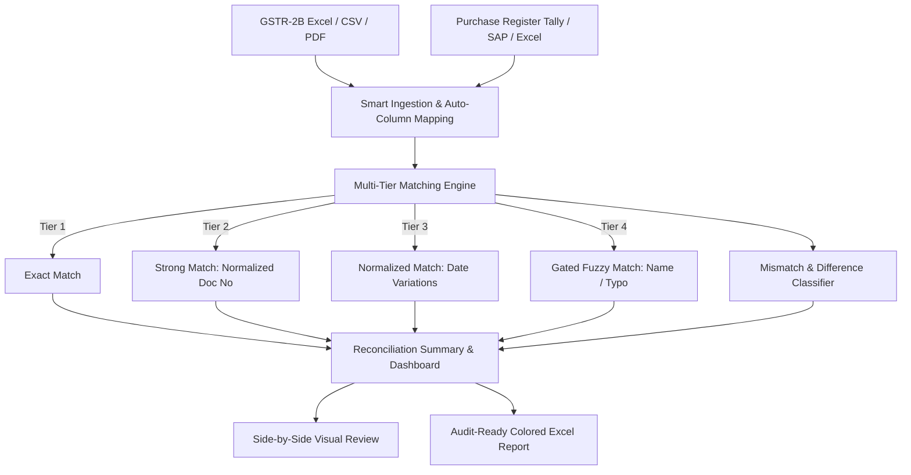

# GST Reconciler 🇮🇳

[](https://github.com/vipranshusachan/gst-reconciler/actions)
[](https://opensource.org/licenses/Apache-2.0)
[](https://www.python.org/)
[](https://microsoft.com/windows)
[](https://github.com/vipranshusachan/gst-reconciler)

> **Production-grade, offline-first open-source desktop application for Indian businesses, tax professionals, and Chartered Accountants to reconcile GST records (GSTR-2B vs Purchase Register, GSTR-1 vs Sales Ledger) with high precision, intelligent column mapping, fuzzy matching, and deep mismatch explanations.**

---

## ⚡ Super Easy Installation (Quick Start)

### Option 1: Direct Single-File .exe (Recommended for Clients & Accountants)
*No installation, no zip extraction, no Python required!*

1. **[Direct Download GSTReconciler.exe (v1.1.0 - Bright Clean UI)](https://github.com/vipranshusachan/gst-reconciler/releases/download/v1.1.0/GSTReconciler.exe)**
2. Simply double-click **`GSTReconciler.exe`** and the application starts immediately!
3. *(Optional)* Click **"Load Sample Demo"** inside the app to see immediate reconciliation results!

*(Prefer a ZIP archive? Download [GSTReconciler-v1.1.0-windows-x64.zip](https://github.com/vipranshusachan/gst-reconciler/releases/download/v1.1.0/GSTReconciler-v1.1.0-windows-x64.zip))*

---

### Option 2: 60-Second Setup (For Developers & Power Users)
Requires Python 3.11, 3.12, or 3.13:

```bash
# 1. Clone repository
git clone https://github.com/vipranshusachan/gst-reconciler.git
cd gst-reconciler

# 2. Create virtual environment
python -m venv venv
venv\Scripts\activate

# 3. Install in editable mode
pip install -e .

# 4. Launch Desktop Application
gst-reconciler gui
```

Or run headless automated reconciliation via CLI:
```bash
gst-reconciler reconcile --source-a demo/data/gstr2b_sample.xlsx --source-b demo/data/purchase_register_sample.xlsx --export audit_report.xlsx
```

---

## 📋 Table of Contents
- [Why GST Reconciler?](#-why-gst-reconciler)
- [How It Works](#-how-it-works)
- [Key Features](#-key-features)
- [Workflow & Architecture](#-workflow--architecture)
- [Comprehensive Documentation Suite](#-comprehensive-documentation-suite)
- [CLI Reference](#-cli-reference)
- [Troubleshooting & FAQ](#-troubleshooting--faq)
- [Contributing](#-contributing)
- [License](#-license)

---

## 💡 Why GST Reconciler?

Under Indian GST regulations (**Section 16(2)(aa)** of the CGST Act and **Rule 36(4)**), businesses can only claim Input Tax Credit (ITC) if their suppliers have uploaded invoices onto the GST Portal (reflected in **GSTR-2B**). 

Manual reconciliation between internal Purchase Registers (Tally, Busy, SAP, Zoho) and the GST Portal is:
* **Time-consuming**: Thousands of lines of messy invoice numbers and rounded pennies.
* **Error-prone**: Slight formatting variations (e.g., `INV-042` vs `INV/42` vs `0042`) cause false mismatches.
* **Risky**: Claiming ineligible ITC causes heavy interest and penalty notices; missing eligible ITC hurts cash flow.
* **Privacy Risks**: Cloud-based tools require uploading sensitive sales and supplier financial records.

**GST Reconciler is 100% offline and runs completely on your own machine. Your data never touches any external server.**

---

## 🔍 How It Works



---

## 🚀 Key Features

* **🔒 100% Offline & Private**: Zero cloud dependency, zero telemetry. Persistent storage is local SQLite in WAL mode.
* **📊 Universal Ingestion**: Reads `.xlsx`, `.xls`, `.csv`, searchable PDFs, and scanned invoice images (via modular Tesseract OCR).
* **🧠 Smart Auto Column Mapping**: Automatically detects Indian GST headers (GSTIN, Invoice No, Taxable Value, CGST, SGST, IGST, Cess, Date) with confidence scoring and reusable presets for Tally, Busy, SAP, Zoho, and Portal GSTR-2B.
* **⚡ Multi-Tier Matching Engine**:
  * **Level 1**: Exact Match (`GSTIN + Invoice No + Date + Amounts`)
  * **Level 2**: Strong Match (`GSTIN + Normalized Invoice No + Amounts`)
  * **Level 3**: Normalized Date & Number variation match
  * **Level 4**: Safe Fuzzy Match (Levenshtein & Token Sort on invoice strings and trade names, with strict confidence gating)
* **💰 Penny-Rounding & Tolerances**: Fully configurable tax and taxable tolerances (e.g. ₹1 to ₹10) with exact `Decimal` arithmetic.
* **🎯 16+ Discrepancy Classifications**: Categorizes mismatches into actionable statuses:
  * `TAXABLE_VALUE_MISMATCH`, `TAX_AMOUNT_MISMATCH`
  * `GSTIN_MISMATCH`, `DATE_MISMATCH`
  * `MISSING_IN_PORTAL_2B`, `MISSING_IN_PURCHASE_REGISTER`
  * `DUPLICATE_IN_PURCHASE_REGISTER`, `POTENTIAL_FUZZY_MATCH`
* **🖥️ Modern Desktop GUI**: Built with PySide6 (Qt6), featuring dark theme, responsive KPI cards, instant filtering, side-by-side invoice comparison, and discrepancy drill-downs.
* **📈 Audit-Ready Excel Export**: Generates professional multi-tab workbooks with colored status tags, financial impact summary, and ITC-at-risk analysis.

---

## 📦 Comprehensive Documentation Suite

| Section | Description | Document Link |
|---|---|---|
| **Master Index** | Master roadmap and complete architectural blueprint | [00-MASTER.md](file:///docs/00-MASTER.md) |
| **Product** | PRD, Personas, Scope, Rule 36(4) / 16(2)(aa) Legal Compliance | [docs/01-PRODUCT](file:///docs/01-PRODUCT/PRODUCT_REQUIREMENTS.md) |
| **Architecture** | System design, clean architecture, SQLite WAL persistence | [docs/02-ARCHITECTURE](file:///docs/02-ARCHITECTURE/SYSTEM_ARCHITECTURE.md) |
| **Data & Models** | Canonical Invoice Model, Normalization & Mapping | [docs/03-DATA](file:///docs/03-DATA/DATA_MODEL.md) |
| **Reconciliation** | Multi-Tier Engine, Tolerances & Classification | [docs/04-RECONCILIATION](file:///docs/04-RECONCILIATION/MATCHING_ENGINE.md) |
| **OCR** | Modular OCR Provider Abstraction & Pipeline | [docs/05-OCR](file:///docs/05-OCR/OCR_ARCHITECTURE.md) |
| **UI & UX** | PySide6 Architecture, Design System & Screens | [docs/06-UI](file:///docs/06-UI/UI_ARCHITECTURE.md) |
| **Testing** | Strategy, Test Matrix, Golden Datasets & Benchmarks | [docs/08-TESTING](file:///docs/08-TESTING/TEST_STRATEGY.md) |
| **Deployment** | PyInstaller Spec, Inno Setup Installer, CI/CD | [docs/09-DEPLOYMENT](file:///docs/09-DEPLOYMENT/WINDOWS_BUILD.md) |
| **Security** | Privacy Guarantees, Threat Model (STRIDE) | [docs/10-SECURITY](file:///docs/10-SECURITY/SECURITY.md) |
| **Developer** | Setup, Conventions, Code Style, Debugging | [docs/11-DEVELOPER](file:///docs/11-DEVELOPER/DEVELOPMENT_SETUP.md) |
| **User Guide** | Installation, Step-by-Step Guide, FAQ & Troubleshooting | [docs/12-USER](file:///docs/12-USER/USER_GUIDE.md) |
| **Decisions (ADR)** | Architecture Decision Records (SQLite WAL, PySide6, etc.) | [docs/architecture/decisions](file:///docs/architecture/decisions/001-offline-first-sqlite.md) |

---

## 💻 CLI Reference

The application can also be operated headlessly for enterprise batch workflows:

```text
Usage: gst-reconciler [OPTIONS] COMMAND [ARGS]...

Commands:
  gui        Launch the PySide6 Desktop User Interface
  reconcile  Run headless reconciliation on two files and generate an audit report
  version    Display current software version and environment information
```

### CLI Example
```bash
gst-reconciler reconcile \
  --source-a demo/data/gstr2b_sample.xlsx \
  --source-b demo/data/purchase_register_sample.xlsx \
  --export final_reconciliation.xlsx \
  --tolerance-tax 1.0 \
  --tolerance-date 30 \
  --fuzzy
```

---

## 🔧 Troubleshooting & FAQ

| Problem | Cause | Solution |
|---|---|---|
| **Windows SmartScreen warning** | The standalone installer is not digitally signed with an expensive EV certificate. | Click **"More info"** and then **"Run anyway"**. The application is 100% open source and safe. |
| **Unmapped columns during import** | Spreadsheet headers differ significantly from common standards. | In Step 2 of the Import Wizard, manually choose the correct column from the dropdown. Save it as a custom profile for next time! |
| **Large Excel file import is slow** | File has 50,000+ rows with cell formatting. | Save file as `.csv` or export plain `.xlsx` from your ERP for maximum ingestion speed. |
| **PySide6 won't start on Linux/WSL** | Missing X11/Wayland display libraries. | Install `libxcb-cursor0` or run natively on Windows. |

---

## 🤝 Contributing

Contributions are welcome! Please check out [CONTRIBUTING.md](file:///CONTRIBUTING.md) to set up your local development environment and submit pull requests.

1. Fork the repo: `https://github.com/vipranshusachan/gst-reconciler`
2. Create your feature branch (`git checkout -b feature/amazing-feature`)
3. Run tests (`python -m pytest tests/`)
4. Commit your changes (`git commit -m 'feat: add amazing feature'`)
5. Push to the branch (`git push origin feature/amazing-feature`)
6. Open a Pull Request

---

## ⚖️ License

Distributed under the **Apache License, Version 2.0**. See [`LICENSE`](file:///LICENSE) for details.
